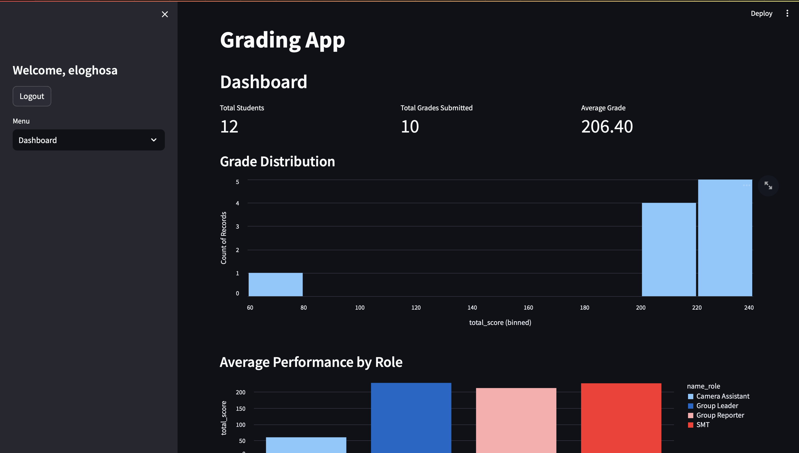
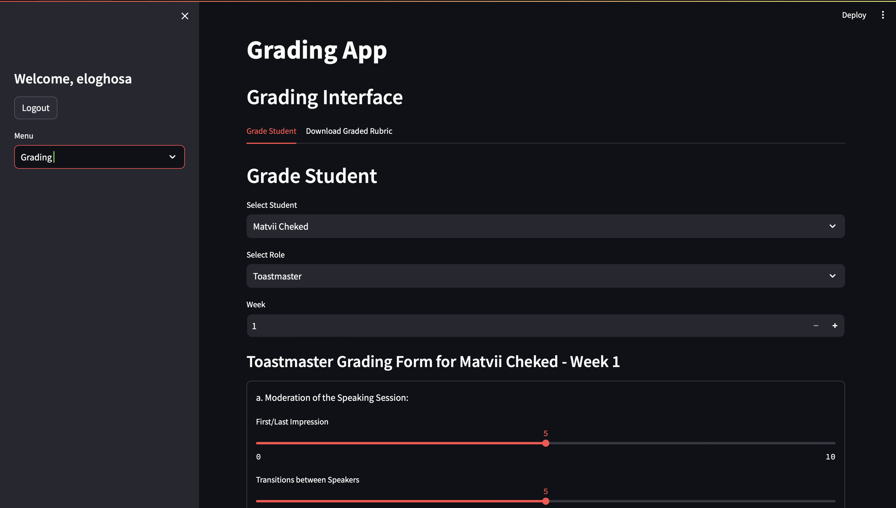

# Lab Grading Application

## Overview
The Lab Grading Application is a streamlined tool for managing laboratory course grading. Built with Streamlit, this application allows teachers to efficiently handle student information, assign weekly roles, grade students, and generate detailed grade sheets.






## Key Features
- **User Authentication**: Secure login and registration for teachers.
- **Student Management**: Easily add, edit, and remove students.
- **Role Assignment**: Assign specific lab roles to students each week.
- **Grading Interface**: Grade students based on their assigned roles.
- **Dashboard**: View real-time grading statistics and individual student performance.
- **Grade Sheet Generation**: Download grade sheets in Excel format for easy reporting.

## Project Structure
```
lab_grading_app/
│
├── app.py                 # Main application entry point
├── auth.py                # Authentication functions (login/register)
├── data_manager.py        # Data handling and storage operations
├── grading.py             # Grading logic for students' performance
├── initialize_csv_db.py   # Script to initialize CSV databases for first-time setup
├── requirements.txt       # Python dependencies
├── rubric_generator.py    # Generates grading rubrics based on roles
├── utils.py               # Utility functions shared across the app
│
├── components/            # Streamlit UI components
│   ├── __init__.py
│   ├── dashboard.py       # Dashboard components for displaying statistics
│   ├── download_gradesheet.py # Generates downloadable grade sheets
│   ├── grading_interface.py   # UI for grading students
│   └── student_management.py  # UI for managing students
│
└── data/                  # Data storage in CSV format
    ├── grades.csv         # Stores student grades
    ├── roles.csv          # Defines weekly student roles
    ├── students.csv       # Stores student information
    └── teachers.csv       # Stores teacher login credentials
```

## Getting Started

### Installation

1. Clone the repository:
   ```bash
   git clone https://github.com/elotech47/lab_course_grading_app.git
   cd lab_grading_app
   ```

2. (Optional) Create a virtual environment for the project:
   ```bash
   python -m venv venv
   source venv/bin/activate  # On Windows: venv\Scripts\activate
   ```

3. Install required Python packages:
   ```bash
   pip install -r requirements.txt
   ```

### Running the Application

1. Initialize the CSV databases (first-time setup):
   ```bash
   python initialize_csv_db.py
   ```

2. Launch the Streamlit application:
   ```bash
   streamlit run app.py
   ```

3. Open your browser and go to the URL provided by Streamlit (default is `http://localhost:8501`).

## Application Components

- **Authentication**: Teachers can register or log in to access grading features.
- **Student Management**: Manage student data such as adding, editing, or removing students from the system.
- **Role Assignment**: Assign weekly lab roles for students (e.g., team leader, recorder, etc.).
- **Grading Interface**: Provide grades based on students' weekly roles and performance.
- **Dashboard**: View an overview of class performance and student-specific grades.
- **Grade Sheet Generation**: Export detailed grade sheets in Excel format for reporting or archival purposes.

## Data Management

All data is stored in CSV format for simplicity:
- `students.csv`: Contains the list of students and their details.
- `teachers.csv`: Stores teacher account information for authentication.
- `roles.csv`: Defines lab roles assigned to students.
- `grades.csv`: Records the grades assigned to students for each week.

## Contributing

Contributions are welcome! To contribute, follow these steps:

1. Fork the repository.
2. Create a new branch (`git checkout -b feature-branch`).
3. Make your changes and commit (`git commit -am 'Add new feature'`).
4. Push your branch to the remote repository (`git push origin feature-branch`).
5. Open a Pull Request for review.

## License

This project is licensed under the [MIT License](https://opensource.org/licenses/MIT).

## Contact

For support or any queries, please reach out via email: eloghosaefficiency@gmail.com.
